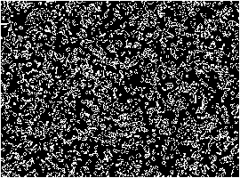

# Game-of-Life-cpp - An implementation of Conway's Game of Life in c++

This demonstration was made using [SDL2](https://www.libsdl.org/)



## Building
If you're using Windows you can download the game [here](https://github.com/Some-Guy-2017/game-of-life-cpp/releases/tag/v1.0.0) - otherwise you can build it with `make`

```bash
# run the project
make run

# build the binary and execute it
make
./game-of-life

# clean the binary
make clean
```
